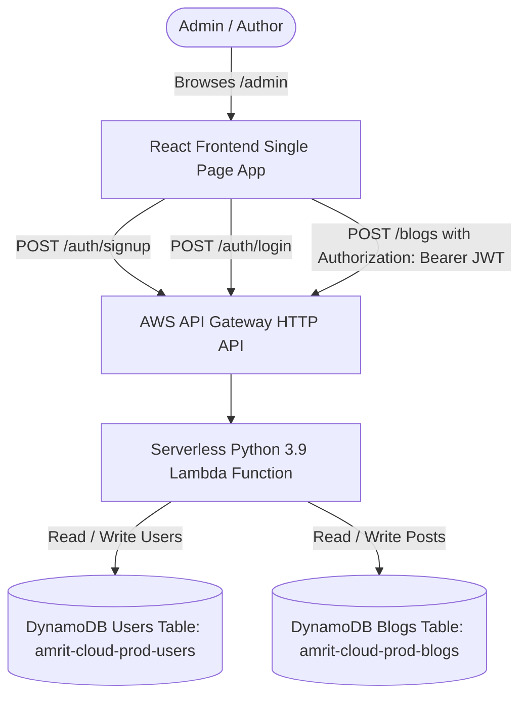

# Blog & Admin CMS System Architecture

This document details the architecture, security mechanisms, API specifications, and database models implemented for the personal portfolio Blog & CMS on `amrit.cloud`.

---

## Architecture Diagram



---

## 1. Authentication & Security Layer

### Password Hashing (PBKDF2-HMAC-SHA256)

- **Standard**: Password strings are hashed using standard library `hashlib.pbkdf2_hmac`.
- **Algorithm**: `SHA-256` with **100,000 iterations**.
- **Salt**: 16-byte cryptographically secure random salt (`os.urandom(16)`), base64-encoded and stored per user.
- **Verification**: `hmac.compare_digest` is used to prevent timing attacks during hash comparisons.

### JSON Web Tokens (JWT)

- **Algorithm**: HMAC-SHA256 (`HS256`).
- **Expiration**: 8 hours (`exp = current_time + 28800`).
- **Storage**: Client-side `sessionStorage` (`admin_auth_token` and `admin_user_info`).
- **Session Protection**: Protected endpoints (`POST /blogs`) verify JWT signature and token expiration. Returns `401 Unauthorized` on expired sessions.

---

## 2. API Endpoint Specifications

| Endpoint                | Method   | Auth Required | Description                                                                                          |
| :---------------------- | :------- | :------------ | :--------------------------------------------------------------------------------------------------- |
| `/auth/signup`          | `POST`   | No            | Registers a new admin user in DynamoDB (`verified=false`) and emails a verification JWT via AWS SES. |
| `/auth/login`           | `POST`   | No            | Authenticates user if `verified=true`. Returns an 8-hour JWT session token.                          |
| `/auth/verify-email`    | `POST`   | No            | Validates the verification JWT from the email link and updates the user's `verified` status to true. |
| `/auth/forgot-password` | `POST`   | No            | Looks up the user by email and sends a password reset JWT link via AWS SES.                          |
| `/auth/reset-password`  | `POST`   | No            | Validates the reset JWT, hashes the new password using PBKDF2, and updates DynamoDB.                 |
| `/blogs`                | `GET`    | No            | Fetches all published blog posts sorted by `publishDate` descending.                                 |
| `/blogs/{slug}`         | `GET`    | No            | Fetches a single blog post by its unique URL slug.                                                   |
| `/blogs`                | `POST`   | **Yes (JWT)** | Creates/publishes a new blog post in DynamoDB.                                                       |
| `/blogs/{slug}`         | `PUT`    | **Yes (JWT)** | Edits an existing blog post while preserving likes and comments.                                     |
| `/blogs/{slug}`         | `DELETE` | **Yes (JWT)** | Permanently deletes an existing blog post from DynamoDB.                                             |

---

## 3. Database Schema (AWS DynamoDB)

### Users Table (`amrit-cloud-prod-users`)

- **Primary Key**: `username` (String)
- **Data Protection**: Deletion Protection is **ENABLED** to prevent accidental loss of admin accounts.

```json
{
  "username": "amrit",
  "email": "amrit@example.com",
  "password_hash": "base64_encoded_pbkdf2_hash",
  "salt": "base64_encoded_16byte_salt",
  "role": "admin",
  "createdAt": "2026-07-04T20:00:00Z"
}
```

### Blogs Table (`amrit-cloud-prod-blogs`)

- **Primary Key**: `slug` (String)
- **Global Secondary Index**: `PublishDateIndex` (hash_key: `publishDate`)
- **Data Protection**: Deletion Protection is **ENABLED** to prevent accidental loss of published blogs.

```json
{
  "slug": "building-python-serverless-backend",
  "title": "Building a Serverless Python Backend on AWS",
  "summary": "Custom Serverless backend using AWS DynamoDB, Lambda, and API Gateway.",
  "publishDate": "2026-07-04T12:00:00Z",
  "coverImage": "https://images.unsplash.com/...",
  "readTime": "8 min read",
  "tags": ["Python", "Serverless", "DynamoDB"],
  "author": {
    "name": "Amrit",
    "avatar": "https://avatars.githubusercontent.com/u/79965355?v=4"
  },
  "content": "# Markdown Content..."
}
```

---

## 4. Frontend Component Structure

- **[AdminDashboard.js](file:///Users/breeze/workspace/myPortfolio/src/pages/admin/AdminDashboard.js)**: Tabbed CMS layout (**Write a New Post** & **Manage Posts**), real-time form validation, session protection, markdown editor with live preview, existing post listing, and edit/delete capabilities.
- **[Login.js](file:///Users/breeze/workspace/myPortfolio/src/pages/login/Login.js)**: Tabbed authentication card (**Sign In** & **Sign Up**), custom and Google OAuth flows, and role-based redirection to the CMS or homepage.
- **[apiClient.js](file:///Users/breeze/workspace/myPortfolio/src/utils/apiClient.js)**: API client functions (`createBlog`, `updateBlog`, `deleteBlog`, `loginAdmin`), session storage management, and local offline dev fallback.
- **[AdminDashboard.css](file:///Users/breeze/workspace/myPortfolio/src/pages/admin/AdminDashboard.css)**: Glassmorphic dark/light UI card styling, tab bar indicators, styled lists for managing blogs, and responsive markdown editor split pane.

---

## 5. Automated Quality & Security Testing

- **Backend Pytest (`pytest test_app.py`)**: 37 test cases covering hashing, auth flows, DynamoDB interactions (create, read, update, delete blogs), and engagement (likes/comments).
- **Frontend Jest (`npm test`)**: Comprehensive test suite covering Auth flows (Login.js), UI rendering, and mock API interactions (AdminDashboard.js) maintaining over 80% coverage.
