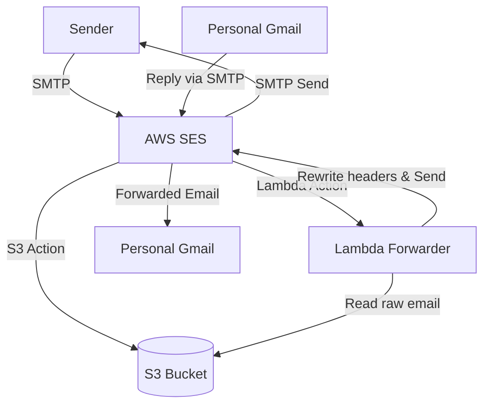

# Email Forwarding Architecture

This document describes the serverless email forwarding architecture for `amrit.cloud`, allowing you to receive emails on your custom domain and reply from your personal Gmail account.

## 1. Architecture Overview

### Request Flow (Inbound)

1. An external sender emails `admin@amrit.cloud`.
2. AWS SES receives the email, verifies MX and DKIM records via Route 53.
3. An SES Receipt Rule Set is triggered.
4. Action 1: The raw email is saved to an S3 bucket (`inbound-mail-amrit-cloud-*`).
5. Action 2: An SES event directly invokes the Lambda Forwarder function (`ses-email-forwarder`).
6. The Python 3.9 Lambda reads the raw email from S3.
7. The Lambda rewrites the `From`, `Reply-To`, and `To` headers to bypass SES Sandbox restrictions and preserve the original sender's address for replies.
8. The Lambda uses `boto3` to send the modified email via SES to `iamamrit990@gmail.com`.

### Request Flow (Outbound/Reply)

1. You compose an email in your personal Gmail.
2. In the "From" dropdown, you select `admin@amrit.cloud`.
3. Gmail uses the provided AWS IAM SMTP credentials to authenticate with SES (`email-smtp.us-east-1.amazonaws.com`).
4. SES relays the email out to the recipient as if it were sent directly from `admin@amrit.cloud`.

---

## 2. Catch-All & Multiple Aliases

The architecture is designed as a **Catch-All** configuration, meaning you do not need to update any infrastructure code to add new `@amrit.cloud` email addresses (e.g., `amrit@amrit.cloud`, `hello@amrit.cloud`).

### How it works dynamically:

1. **The SES Rule**: The `aws_ses_receipt_rule` is configured with `recipients = ["amrit.cloud"]`. In AWS SES, specifying the apex domain without a local part acts as a wildcard, catching _any_ email addressed to that domain.
2. **The Lambda**: The Python forwarder parses the raw email from S3 and extracts the original destination address (`mail_info['destination'][0]`). It rewrites the `From` header to use this exact address.
3. **The SES Sandbox Policy**: Because the entire `amrit.cloud` domain identity is verified in SES, AWS permits the Lambda (and your SMTP credentials) to send outgoing emails from _any_ address ending in `@amrit.cloud`.

### Setting up multiple addresses in Gmail:

If you want to be able to reply from both `admin@amrit.cloud` and `amrit@amrit.cloud`, you simply add them as multiple aliases in your personal Gmail.

They will share the **same** SMTP credentials:

1. In Gmail Settings > **Accounts and Import**, click **Add another email address**.
2. Enter your new address (e.g., `amrit@amrit.cloud`).
3. Enter the same SMTP Server (`email-smtp.us-east-1.amazonaws.com`), Username, and Password.
4. When replying to an email, Gmail will let you select which alias you want to send from via a dropdown menu.

---

## 3. Infrastructure Resources (Terraform)

All resources are provisioned in the `infra/modules/email` module.

| Service      | Resource                   | Description                                                        |
| ------------ | -------------------------- | ------------------------------------------------------------------ |
| **Route 53** | `aws_route53_record`       | DKIM CNAME records and MX record pointing to SES inbound endpoint. |
| **SES**      | `aws_ses_domain_identity`  | Domain verification for `amrit.cloud`.                             |
| **SES**      | `aws_ses_email_identity`   | Email verification for `iamamrit990@gmail.com`.                    |
| **SES**      | `aws_ses_receipt_rule_set` | Rule to process incoming emails for `amrit.cloud`.                 |
| **S3**       | `aws_s3_bucket`            | Storage for incoming raw emails.                                   |
| **Lambda**   | `aws_lambda_function`      | Python 3.9 script to parse and forward emails.                     |
| **IAM**      | `aws_iam_user`             | User `ses-smtp-user` used by Gmail for SMTP auth.                  |

---

## 4. Cost Breakdown (Estimated Monthly)

This setup is highly cost-effective and heavily leverages AWS Free Tiers.

### Assumptions:

- **Volume:** 1,000 incoming emails / month.
- **Size:** Average email size of 100 KB.

### 1. Amazon SES

- **Inbound Emails:** The first 1,000 incoming emails per month are **FREE**. (\$0.10 per 1,000 after).
- **Outbound Emails:** Since we call SES from an AWS Lambda function, you get **62,000 outbound messages per month FREE**.
- **Data Transfer:** Data transfer in is free. Data out is free up to 100GB/month across AWS.
- **Estimated Cost: \$0.00 / month**

### 2. Amazon S3 (Storage)

- **Storage:** 1,000 emails \* 100 KB = 100 MB per month. The S3 Standard Free Tier includes 5 GB per month.
- **PUT Requests (SES to S3):** 1,000 requests. The Free Tier includes 2,000 PUT requests per month.
- **GET Requests (Lambda to S3):** 1,000 requests. The Free Tier includes 20,000 GET requests per month.
- **Estimated Cost: \$0.00 / month**

### 3. AWS Lambda (Compute)

- **Invocations:** 1,000 requests per month. The Free Tier includes 1,000,000 requests per month.
- **Compute Time:** Assuming 500ms execution time @ 128 MB RAM. Free Tier includes 400,000 GB-seconds per month.
- **Estimated Cost: \$0.00 / month**

### 4. Amazon Route 53 (DNS)

- **Hosted Zone:** \$0.50 per hosted zone per month (already incurred by the existing `amrit.cloud` domain).
- **DNS Queries:** MX and CNAME lookups are a negligible fraction of a cent.
- **Estimated Cost: \$0.00 / month (Incremental)**

### Total Estimated Cost: \$0.00 / month

As long as your email volume stays under a few thousand per month, this entire email forwarding architecture will remain fully covered by the AWS Free Tier.

---

## 5. Troubleshooting & Known Issues

If emails sent to your custom domain do not arrive in your personal Gmail, follow these steps:

### 1. Check AWS CloudWatch Logs

The most common point of failure is the Python Lambda Forwarder.

1. Open the AWS Console and go to **CloudWatch > Log groups**.
2. Search for the log group: `/aws/lambda/ses-email-forwarder`.
3. Check the most recent log streams for any `[ERROR]` traces.

### 2. Common Errors

**Error:** `InvalidParameterValue: Extra route-addr`

- **Cause:** AWS SES strictly validates the `From` header format. If a forwarded email originally contained angle brackets (e.g., `Sender Name <sender@example.com>`), naively wrapping it in another set of angle brackets (e.g., `Sender Name <sender@example.com> <amrit@amrit.cloud>`) will cause SES to reject the email.
- **Fix:** The `forwarder.py` script mitigates this by replacing the original `From` header entirely with the verified custom domain address (e.g., `amrit@amrit.cloud`). It preserves the original sender's address in the `Reply-To` header so that replying in Gmail still works natively.

**Error:** `InvalidParameterValue: Duplicate header 'DKIM-Signature'` (or similar SES duplicate headers)

- **Cause:** When an email arrives via SES, AWS attaches tracking and DKIM security signatures. When the Lambda reads this raw email from S3 and attempts to send it _back_ through SES, SES throws an error because it's trying to attach _new_ signatures to an email that already has them.
- **Fix:** The `forwarder.py` explicitly strips a hardcoded list of headers (e.g., `DKIM-Signature`, `X-SES-RECEIPT`, `Message-ID`, `Return-Path`) from the raw `email.Message` object before forwarding it.

**Error:** `MessageRejected: Email address is not verified.`

- **Cause:** The AWS account is in the SES Sandbox and is trying to send an email _to_ an unverified destination address.
- **Fix:** Ensure that the destination email (`iamamrit990@gmail.com`) has been verified via the link AWS sent to the inbox.
